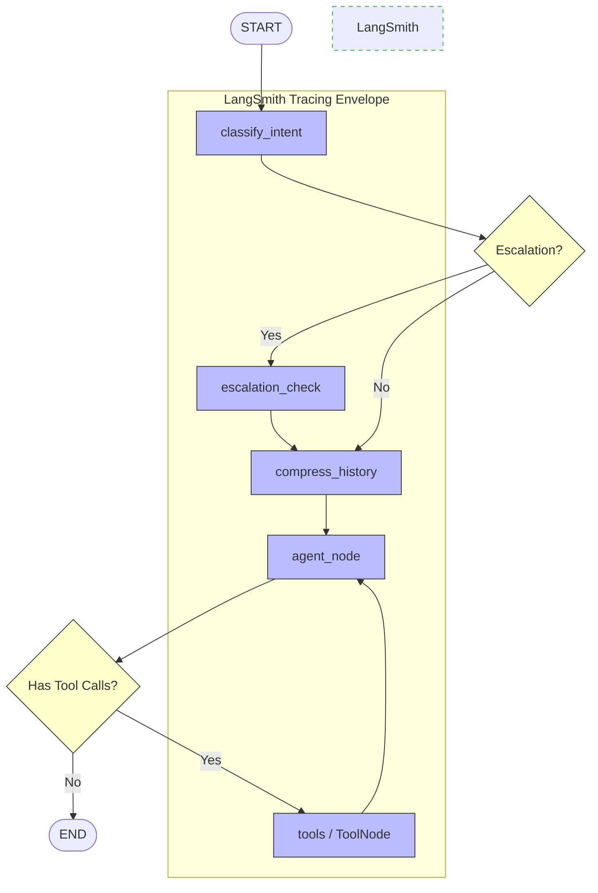

# 🌌 Atlas Multimodal AI Portal (v3.0.0)

**🌐 Live Demo:** [https://atlas-multimodal-ai-portal.onrender.com/](https://atlas-multimodal-ai-portal.onrender.com/)

<p align="center">
  
</p>

Atlas is an advanced, enterprise-grade operations co-pilot and industrial support chatbot. Built on a modular **LangGraph** state machine and a high-performance **FastAPI** backend, Atlas features a premium glassmorphic frontend UI designed to assist industrial engineers, plant operators, and researchers.

---

## 📊 Architecture & Tracing Flow

Below is the state machine representation of the agentic workflow. With **LangSmith Tracing** enabled, every node transition, LLM call, and tool execution pictured below is tracked in real-time:



---

## 🧠 Production-Grade Agentic Patterns

Atlas is built on architectural patterns designed to handle the realities of deploying agentic systems in production:

### 1. Robust State & Memory Hydration
- **SQLite Checkpointer (WAL Mode):** Replaces memory savers with transactional SQLite storage. The state is loaded and saved atomically at every step boundary, enabling session persistence across server crashes or scaling restarts.
- **Fact-Based Long-Term Memory:** Extracts structured entity relationships from conversations and writes them to a persistent SQLite Knowledge Graph. These memories are injected into the agent system prompt on thread load, matching user preference/history without wasting token budget.
- **Context Summarization:** When messages exceed 12 turns, a compression node consolidates older history into a running semantic summary while keeping the last few messages fresh.

### 2. Multi-Tier Error Resilience
- **Automated API Key Rotation:** Automatically cycles through multiple backup Groq API keys on hitting a `429 Rate Limit Error` to guarantee high availability.
- **Dynamic Model Fallback:** Automatically switches to alternative settings-based model names or rotates API keys if the primary setup experiences failures.
- **Exponential Backoff:** Retries failing LLM calls with customizable backoff delays.

### 3. Observability & LangSmith Integration
By activating LangSmith tracing, you unlock:
- **Trace Tagging & Metadata:** Automatically attaches rich metadata to every trace execution (such as `username`, `thread_id`, `language`, and `interface` (`web`/`cli`/`debug`)), enabling direct filtering, grouping, and analysis of runs in the LangSmith dashboard.
- **Playground Debugging:** Inspect and tweak the exact system prompt and tool results for any run directly from the cloud UI.
- **Token & Cost Control:** Monitor exact prompt/completion token usage across multiple runs.
- **Latency & Bottleneck Analysis:** Pinpoint which node (e.g., intent classification, tools execution) is slowing down the response.
- **Run Feedback Loops:** Capture and log user feedback on agent responses directly to LangSmith datasets for future fine-tuning.

---

## 🚀 Key Features

### 🧠 Agentic & Memory Core
- **LangGraph ReAct Architecture:** Seamless transition between intent classification, history compression, and ReAct loop execution.
- **Long-Term Memory:** Extracts permanent user/equipment facts into an SQLite entity-relation knowledge graph for personalized future context.
- **Context Compression:** Intelligent conversation summarization once history exceeds a limit, keeping token counts optimal.
- **Automatic Multi-Language Alignment:** Proactively detects and responds in the user's language (supporting English, Hindi, Gujarati, Tamil, Telugu, Hinglish, etc.).
- **Real-Time Web Search:** Queries the web on demand using integrated DuckDuckGo HTML scraping.
- **Real-Time Stock Lookup:** Retrieves stock prices and market metrics for any public company ticker symbol.

<p align="center">
  
</p>

---

## 🌟 Comprehensive Capabilities Matrix

Atlas supports a broad set of production and enterprise capabilities out-of-the-box, with built-in integrations and extensibility paths:

### 🟢 AI Agent Capabilities
* **💬 Natural Language Conversation:** Context-aware, human-like dialog with translation alignment.
* **🧠 Conversation Memory:** Real-time context compression, session persistence, and fact extraction.
* **🌍 Multi-Language Support:** Auto-detection and output alignment in 10+ major regional languages.
* **📄 Document Understanding:** PDF text extraction, document parsing, and token-safe summarization.
* **🔍 Semantic Search (RAG):** Hybrid BM25/Dense retrieval over local knowledge bases.
* **🌐 Web Search & Stock Pricing:** Real-time web result parsing and public stock ticker metrics.
* **🧮 Calculator & Reasoning:** Parser supporting mathematical, engineering, and chronological calculations.

### 🟢 Multimodal AI
* **🖼️ Image Understanding:** Vision-enabled analysis of schematics, drawings, or UI layouts.
* **📸 OCR & Document Intelligence:** Text extraction from invoices, contracts, manuals, and receipts.
* **📊 Chart & Graph Interpretation:** Analysis of trendlines, telemetry dashboards, and data sheets.
* **🎤 Speech & Audio Processing:** Transcription powered by Whisper-large-v3.

### 🟢 Productivity & Automation
* **✍️ Content Generation:** PowerPoint slide compilation (`.pptx`), PDF report generation (`.pdf`), and Markdown exports.
* **🛠️ Coding Assistant:** Code explanation, optimization, SQL query writing, and debug assistance.
* **📅 Productivity Integrations:** Structured format exports (tickets, SOP summaries, handover logs).
* **🛡️ Security & Enterprise Controls:** Role verification, sliding window rate limits, JWT session authentication, brute force protection, and structured audit logs.

### 🖼️ Multimodal Intelligence
- **Text-to-Image Generation:** Integrates Pollinations AI to generate schematics, charts, or diagrams. Assets are automatically downloaded and hosted locally for persistence.
- **Text-to-Video Generation:** Integrates Replicate's Stable Video Diffusion to generate short clips.
- **Audio & Video Transcription:** Transcribes media inputs using Whisper-large-v3.
- **PDF Text Extractor:** Automatically extracts content from uploaded documents and appends it to the LLM context.

### 📊 Interactive Visualizations & Artifacts
- **Interactive Presentation Presenter (`<presentation>`):** Renders slide decks in the UI with a native fullscreen slideshow player.
- **Research Poster Viewer (`<poster>`):** Renders scientific/academic multi-column research posters inside the canvas workspace.
- **Dynamic Charts (`<chart>`):** Automatically renders line, bar, or radar charts using Chart.js based on telemetry or numerical data.
- **SCADA Simulator:** Live SCADA alarm trigger simulator that pushes simulated sensor values directly into the active chat.
- **Ready-Made Playbooks:** A built-in prompt template library with pre-configured playbooks for diagnosing pump anomalies, hydraulic press faults, and conveyor trips.

<p align="center">
  
</p>

### 📥 Enterprise Document Export
- **Slide Decks (`.pptx`):** Generates and downloads native PowerPoint slide presentations from LLM-designed slides using `python-pptx`.
- **Scientific Posters (`.pdf`):** Exports high-fidelity, landscape PDF scientific posters styled using `reportlab`.
- **Chat History:** Instantly download entire conversation threads as Markdown (`.md`) or plain text (`.txt`).

### 🛡️ Enterprise Security & Resilience
- **JWT Session Management:** HTTP-only, signed JWT session cookies with customizable TTL.
- **Lockout Protection:** Temporary IP and account lockouts after repeated failed logins to prevent brute-force attacks.
- **Strict Media Validation:** Upload validator sniffing magic-bytes (not just extensions) to block malicious file payloads.
- **Robust Rate Limiting:** Sliding-window rate limiter per-endpoint and per-user.
- **Audit Logs:** Full logging of authentication events, chat history, exports, and critical actions.

### 🔍 Production Observability
- **LangSmith Tracing:** Deep observability, tracing agent state transitions, intent classifications, raw prompts/responses, and exact tool invocation inputs/outputs.

---


## 🛠️ Technology Stack

| Component | Technology |
| :--- | :--- |
| **Backend Framework** | FastAPI, Python 3.11+ |
| **Agentic State Machine** | LangGraph, LangChain Core |
| **Observability & Tracing** | LangSmith |
| **Database & Persistence** | SQLite (WAL mode, index-optimized) |
| **Media Extraction** | Whisper-large-v3, pypdf |
| **Export Engines** | python-pptx, reportlab |
| **Frontend UI** | Vanilla ES6+ JS, CSS3 Custom Variables (Warm Terracotta Theme) |
| **Libraries** | Lucide Icons, Marked.js (Markdown), Chart.js |

---

## 📂 Project Structure

```bash
├── asset_export.py     # Download helpers, PowerPoint PPTX & PDF poster compilers
├── config.py           # Central Settings class and environment configuration
├── cli.py              # Terminal CLI client for local debugging
├── Dockerfile          # Containerization template
├── graph.py            # LangGraph state machine flow setup
├── logger.py           # Custom formatted console/file logging
├── main.py             # FastAPI App (endpoints, JWT authentication, SSE stream)
├── nodes.py            # Graph nodes logic & SYSTEM_PROMPT definitions
├── readme.md           # Project documentation (this file)
├── requirements.txt    # Python package dependencies
├── state.py            # TypedDict definition of the chat state
├── tools.py            # Custom tools: RAG retriever, SCADA status, calculator
└── static/             # Frontend web assets
    ├── index.html      # Main single-page application UI
    └── uploads/        # Uploaded images, audio, and documents
```

---

## ⚙️ Configuration & Environment Variables

Create a `.env` file in the root directory to configure the application:

```ini
# LLM & API Keys
GROQ_API_KEY="gsk_..."
BACKUP_GROQ_API_KEY="gsk_..."  # Optional, rotated automatically on rate limits
REPLICATE_API_TOKEN="r8_..."   # Optional, required for video generation

# LangSmith Tracing (Observability)
LANGCHAIN_TRACING_V2="true"
LANGCHAIN_ENDPOINT="https://api.smith.langchain.com"
LANGCHAIN_API_KEY="lsv2_pt_..."
LANGCHAIN_PROJECT="multilingualchat"

# Database Path
SQLITE_DB_PATH="chatbot_memory.db"

# Compression Settings
MAX_MESSAGES_BEFORE_SUMMARY=12
KEEP_LAST_N_AFTER_SUMMARY=4

```

---

## 🚀 Running the Application

### Option A: Running with Docker (Recommended)

1. **Build the Docker Image:**
   ```bash
   docker build -t multitask-chatbot .
   ```

2. **Run the Container:**
   ```bash
   docker run -d -p 8000:8000 --name multitask-chatbot --env-file .env multitask-chatbot
   ```

3. **Access the Portal:**
   Open [http://localhost:8000](http://localhost:8000) in your web browser.

### Option B: Running Locally

1. **Create and Activate a Virtual Environment:**
   ```bash
   python -m venv .venv
   # Windows:
   .venv\Scripts\activate
   # Linux/macOS:
   source .venv/bin/activate
   ```

2. **Install Dependencies:**
   ```bash
   pip install -r requirements.txt
   ```

3. **Start the Uvicorn Server:**
   ```bash
   uvicorn main:app --host 127.0.0.1 --port 8000 --reload
   ```

4. **Verify Application:**
   Open [http://127.0.0.1:8000](http://127.0.0.1:8000) in your browser.

---

## 📝 CLI Mode (For Local Terminal Debugging)

To test the chatbot state machine directly from the command line without the web portal:
```bash
python cli.py --thread my-debug-session
```
*Note: Threads are persisted in SQLite, allowing you to resume terminal sessions later.*