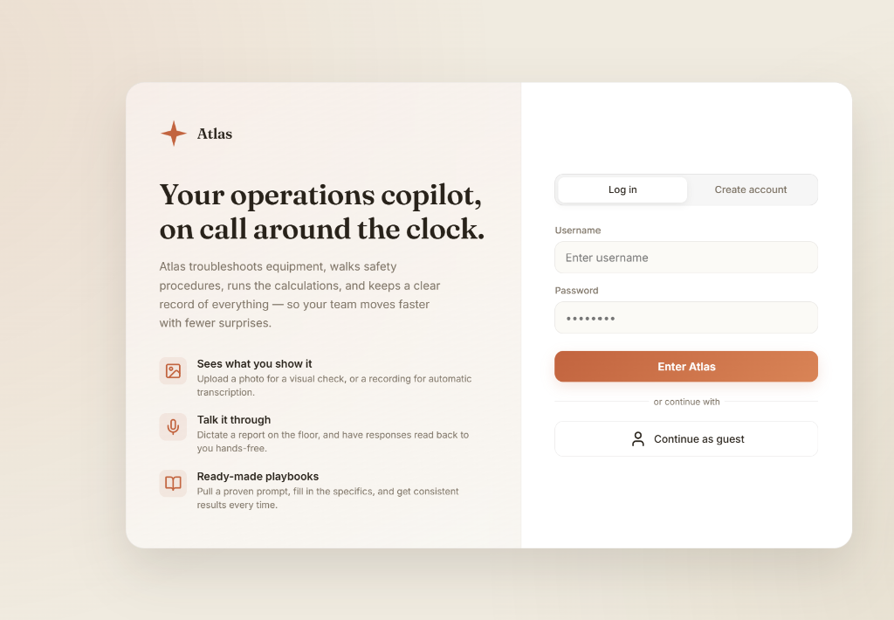
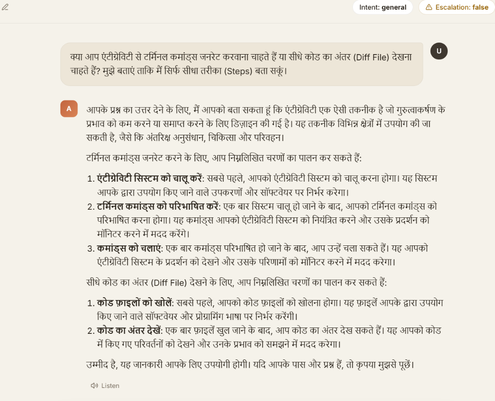
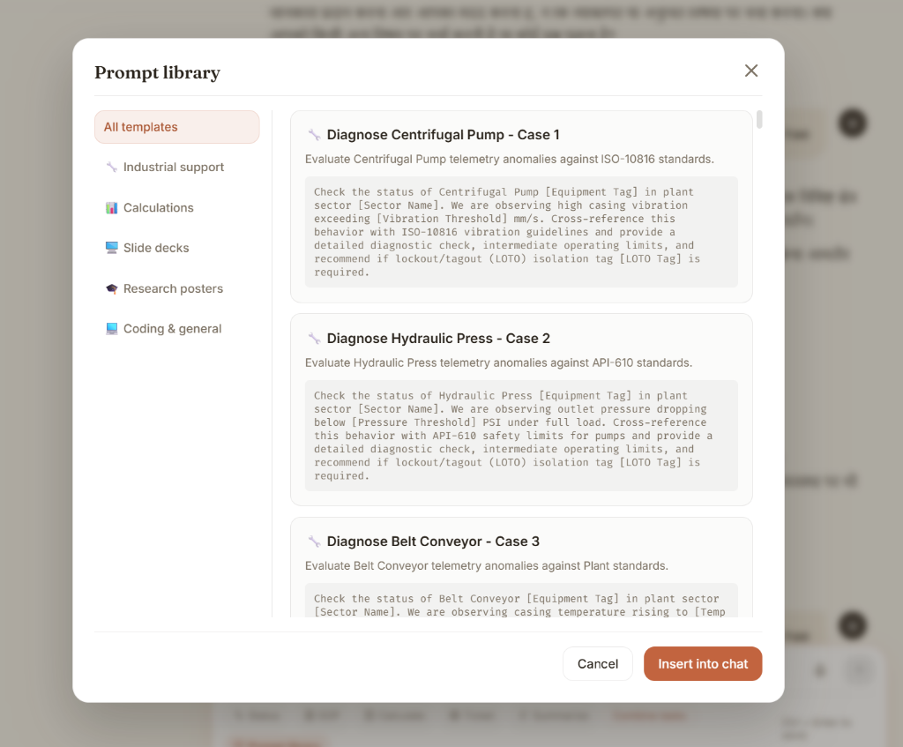

# 🌌 Atlas Multimodal AI Portal (v3.0.0)

<p align="center">
  
</p>

Atlas is an advanced, enterprise-grade operations co-pilot and industrial support chatbot. Built on a modular **LangGraph** state machine and a high-performance **FastAPI** backend, Atlas features a premium glassmorphic frontend UI designed to assist industrial engineers, plant operators, and researchers.

---

## 🚀 Key Features

### 🧠 Agentic & Memory Core
- **LangGraph ReAct Architecture:** Seamless transition between intent classification, history compression, and ReAct loop execution.
- **Long-Term Memory:** Extracts permanent user/equipment facts into an SQLite entity-relation knowledge graph for personalized future context.
- **Context Compression:** Intelligent conversation summarization once history exceeds a limit, keeping token counts optimal.
- **Automatic Multi-Language Alignment:** Proactively detects and responds in the user's language (supporting English, Hindi, Gujarati, Tamil, Telugu, Hinglish, etc.).

<p align="center">
  
</p>

### 🖼️ Multimodal Intelligence
- **Text-to-Image Generation:** Integrates Pollinations AI to generate schematics, charts, or diagrams. Assets are automatically downloaded and hosted locally for persistence.
- **Text-to-Video Generation:** Integrates Replicate's Stable Video Diffusion to generate short clips.
- **Audio & Video Transcription:** Transcribes media inputs using Whisper-large-v3.
- **PDF Text Extractor:** Automatically extracts content from uploaded documents and appends it to the LLM context.

### 📊 Interactive Visualizations & Artifacts
- **Interactive Presentation Presenter (`<presentation>`):** Renders slide decks in the UI with a native fullscreen slideshow player.
- **Research Poster Viewer (`<poster>`):** Renders scientific/academic multi-column research posters inside the canvas workspace.
- **Dynamic Charts (`<chart>`):** Automatically renders line, bar, or radar charts using Chart.js based on telemetry or numerical data.
- **SCADA Simulator:** Live SCADA alarm trigger simulator that pushes simulated sensor values directly into the active chat.
- **Ready-Made Playbooks:** A built-in prompt template library with pre-configured playbooks for diagnosing pump anomalies, hydraulic press faults, and conveyor trips.

<p align="center">
  
</p>

### 📥 Enterprise Document Export
- **Slide Decks (`.pptx`):** Generates and downloads native PowerPoint slide presentations from LLM-designed slides using `python-pptx`.
- **Scientific Posters (`.pdf`):** Exports high-fidelity, landscape PDF scientific posters styled using `reportlab`.
- **Chat History:** Instantly download entire conversation threads as Markdown (`.md`) or plain text (`.txt`).

### 🛡️ Enterprise Security & Resilience
- **JWT Session Management:** HTTP-only, signed JWT session cookies with customizable TTL.
- **Lockout Protection:** Temporary IP and account lockouts after repeated failed logins to prevent brute-force attacks.
- **Strict Media Validation:** Upload validator sniffing magic-bytes (not just extensions) to block malicious file payloads.
- **Robust Rate Limiting:** Sliding-window rate limiter per-endpoint and per-user.
- **Audit Logs:** Full logging of authentication events, chat history, exports, and critical actions.

---


## 🛠️ Technology Stack

| Component | Technology |
| :--- | :--- |
| **Backend Framework** | FastAPI, Python 3.11+ |
| **Agentic State Machine** | LangGraph, LangChain Core |
| **Database & Persistence** | SQLite (WAL mode, index-optimized) |
| **Media Extraction** | Whisper-large-v3, pypdf |
| **Export Engines** | python-pptx, reportlab |
| **Frontend UI** | Vanilla ES6+ JS, CSS3 Custom Variables (Warm Terracotta Theme) |
| **Libraries** | Lucide Icons, Marked.js (Markdown), Chart.js |

---

## 📂 Project Structure

```bash
├── asset_export.py     # Download helpers, PowerPoint PPTX & PDF poster compilers
├── config.py           # Central Settings class and environment configuration
├── cli.py              # Terminal CLI client for local debugging
├── Dockerfile          # Containerization template
├── graph.py            # LangGraph state machine flow setup
├── logger.py           # Custom formatted console/file logging
├── main.py             # FastAPI App (endpoints, JWT authentication, SSE stream)
├── nodes.py            # Graph nodes logic & SYSTEM_PROMPT definitions
├── readme.md           # Project documentation (this file)
├── requirements.txt    # Python package dependencies
├── state.py            # TypedDict definition of the chat state
├── tools.py            # Custom tools: RAG retriever, SCADA status, calculator
└── static/             # Frontend web assets
    ├── index.html      # Main single-page application UI
    └── uploads/        # Uploaded images, audio, and documents
```

---

## ⚙️ Configuration & Environment Variables

Create a `.env` file in the root directory to configure the application:

```ini
# LLM & API Keys
GROQ_API_KEY="gsk_..."
BACKUP_GROQ_API_KEY="gsk_..."  # Optional, rotated automatically on rate limits
REPLICATE_API_TOKEN="r8_..."   # Optional, required for video generation

# Database Path
SQLITE_DB_PATH="chatbot_memory.db"

# Compression Settings
MAX_MESSAGES_BEFORE_SUMMARY=12
KEEP_LAST_N_AFTER_SUMMARY=4
```

---

## 🚀 Running the Application

### Option A: Running with Docker (Recommended)

1. **Build the Docker Image:**
   ```bash
   docker build -t multitask-chatbot .
   ```

2. **Run the Container:**
   ```bash
   docker run -d -p 8000:8000 --name multitask-chatbot --env-file .env multitask-chatbot
   ```

3. **Access the Portal:**
   Open [http://localhost:8000](http://localhost:8000) in your web browser.

### Option B: Running Locally

1. **Create and Activate a Virtual Environment:**
   ```bash
   python -m venv .venv
   # Windows:
   .venv\Scripts\activate
   # Linux/macOS:
   source .venv/bin/activate
   ```

2. **Install Dependencies:**
   ```bash
   pip install -r requirements.txt
   ```

3. **Start the Uvicorn Server:**
   ```bash
   uvicorn main:app --host 127.0.0.1 --port 8000 --reload
   ```

4. **Verify Application:**
   Open [http://127.0.0.1:8000](http://127.0.0.1:8000) in your browser.

---

## 📝 CLI Mode (For Local Terminal Debugging)

To test the chatbot state machine directly from the command line without the web portal:
```bash
python cli.py --thread my-debug-session
```
*Note: Threads are persisted in SQLite, allowing you to resume terminal sessions later.*